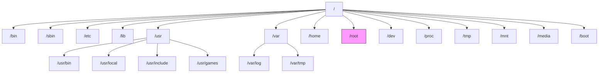

# Linux基础

## 1. 常用命令

```bash
# 查看系统架构
uname -a   

# 更详细的 CPU 架构信息
lscpu

# 查看当前安装的发行版
cat /etc/os-release

# 获取核心数
nproc

# 内存
free -h

# 查找占用 8803 端口的进程 PID
sudo netstat -tulpn | grep :8803

# 压缩/解压命令
tar -czvf test.tar.gz test
tar -xzvf test.tar.gz 

# 查看大小
du -sh 目录

# 查找LIBC库
strings /lib64/libc.so.6 | grep '^GLIBC_'
# 或
strings /lib/x86_64-linux-gnu/libc.so.6 | grep '^GLIBC_'
```

## 2. Linux 目录结构

下面列出常见的 Linux 根目录及其用途（目录名用代码格式高亮）：

- `bin`：binary，常用二进制可执行文件目录，系统启动和普通用户常用命令通常放在这里。
- `sbin`：super binary，系统管理用的二进制程序，通常只有 `root` 可执行（如系统管理命令）。
- `etc`：配置文件目录，系统和应用程序的配置文件通常位于此处。
- `lib`：library，存放运行时需要的共享库（动态库）和静态库。
- `media`：挂载点，用于挂载外部可移动设备（如光盘、扫描仪等）。
- `mnt`：临时挂载目录，常用于手动临时挂载设备（如临时挂载 U 盘）。
- `proc`：内核及进程相关的虚拟文件系统，提供运行时系统信息（例如 `/proc/cpuinfo`）。
- `tmp`：临时文件目录，系统或应用短期使用的临时文件（重启后通常会清空）。
- `boot`：存放启动引导相关文件（如内核、grub 配置等）。
- `home`：普通用户的家目录（每个用户一个子目录，如 `/home/alice`）。
- `root`：`root` 用户的家目录（与 `/home` 下的普通用户家目录不同）。
- `dev`：device，设备文件目录，Linux 把设备抽象为文件（如 `/dev/sda`）。
- `lost+found`：文件系统异常时的恢复目录，通常用于存放 fsck 找到的孤立文件。
- `opt`：可选应用程序安装目录，第三方软件可以安装在此。
- `var`：可变数据目录，存放日志、邮件、缓存、数据库文件等经常变化的数据。
- `usr`：Unix System Resources，包含大多数用户级程序和共享数据。
	- `/usr/bin`：用户级可执行程序目录。
	- `/usr/games`：游戏相关程序目录（部分发行版可能未使用）。
	- `/usr/include`：头文件目录，供开发和编译使用。
	- `/usr/local`：本地安装软件的默认目录，通常用于管理员手动安装的软件（类似 `opt`）。



