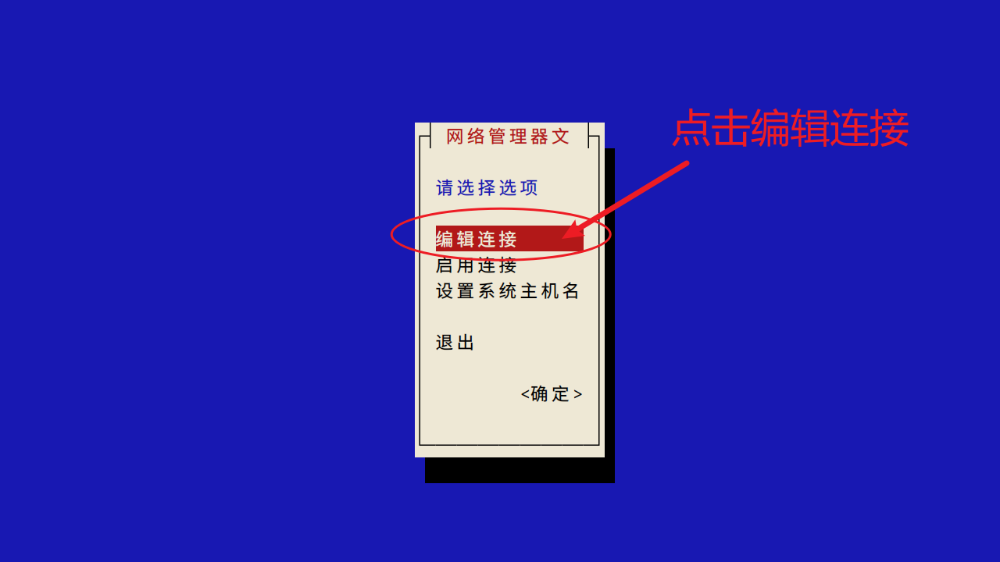
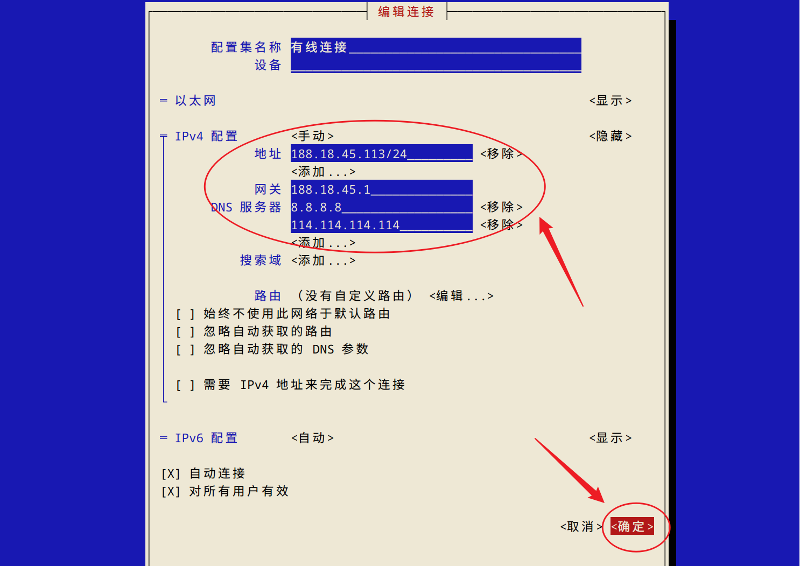

# Linux 配置固定 IP

<!-- 在 VitePress 中可以启用自动 TOC（如果你的主题支持），这里也可以手动添加短章目录 -->

## 概要

本文介绍如何使用 `nmtui` 在 Linux 上配置固定 IP，并提供常见问题的排查步骤和示例配置。

## 目录

- [nmtui 简介](#nmtui-简介)
- [安装与启动](#安装与启动)
- [配置固定 IP](#配置固定ip)
- [网关与 DNS](#网关-gateway)
- [完整配置示例](#完整配置示例)

## nmtui 简介

`NetworkManager Text User Interface`（`nmtui`）是 NetworkManager 的文本用户界面工具，用于简化网络配置操作。

- 功能：支持 `Wi-Fi`、`以太网`、`VPN` 等配置。
- 适用场景：无图形界面的 Linux 服务器或需要快速配置网络的场景。

## 安装与启动

### 检查是否已安装

```bash
which nmtui
# 示例输出：
# /usr/bin/nmtui
```

### 安装（按发行版）

```bash
# CentOS/RHEL/Fedora
sudo yum install NetworkManager-tui    # CentOS 7
sudo dnf install NetworkManager-tui    # CentOS 8+/Fedora

# Debian/Ubuntu（默认使用 netplan，但可手动安装）
sudo apt install network-manager
```

### 启动 `nmtui`

```bash
sudo nmtui
```

启动后会进入基于文本的界面，使用方向键和回车进行选择与确认。若界面无法打开或提示连接错误，请参考下方“故障排查”部分。

### 故障排查

<details>
<summary>NetworkManager 未运行 - 展开查看解决步骤</summary>

```bash
# 启动（适用于 systemd 系统，如 Ubuntu、Debian、Fedora 等）
sudo systemctl start NetworkManager

# 检查状态：查找 "active (running)" 表示已启动
sudo systemctl status NetworkManager

# 可选：设置开机自启
sudo systemctl enable NetworkManager

# 查看日志以获得详细错误信息
journalctl -u NetworkManager -r
```

</details>

::: warning
如果 `nmtui` 启动但界面异常或无法操作，通常是 `NetworkManager` 未运行或配置冲突（如同时使用 `networkd`/`ifupdown` 等）。排查时优先查看 `systemctl status` 和 `journalctl` 日志。
:::

## 配置固定 IP

以下为使用 `nmtui` 界面配置 IPv4 的常见步骤（界面示例图见下）：




### 配置 IPv4

- 将 **IPv4 配置** 从 `自动` 更改为 `手动`。
- 点击 `显示` 展开详细配置项。

### 填写固定 IP 信息（界面字段）

- `地址`：例如 `188.18.45.113/24`（`/24` 表示子网掩码 255.255.255.0）
- `网关`：常见如 `192.168.1.1` 或 `188.18.45.1`（根据你的网络）
- `DNS 服务器`：如 `8.8.8.8, 8.8.4.4`

## 网关 (Gateway) 与 DNS

**网关** 是网络的出口，通常是你路由器或上游网关的 IP 地址。

```bash
# 查看当前网关
ip route show default
# 或者
route -n
```

### 推荐 DNS

```bash
# 谷歌 DNS
8.8.8.8
8.8.4.4

# Cloudflare DNS
1.1.1.1
1.0.0.1

# 国内常用 DNS
114.114.114.114
223.5.5.5
```

查看当前 DNS：

```bash
cat /etc/resolv.conf
```

## 完整配置示例

```bash
IPv4 配置: 手动

地址: 188.18.45.113/24
网关: 188.18.45.1

DNS 服务器:
8.8.8.8
8.8.4.4

搜索域: (可留空)
```

