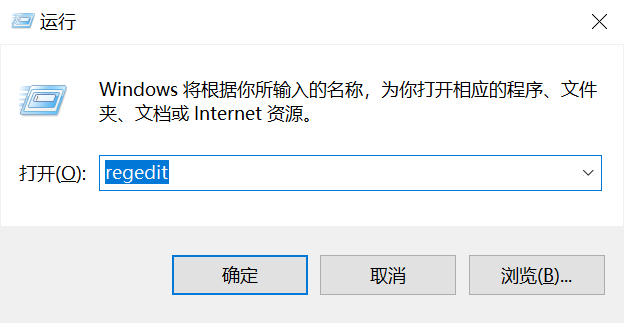
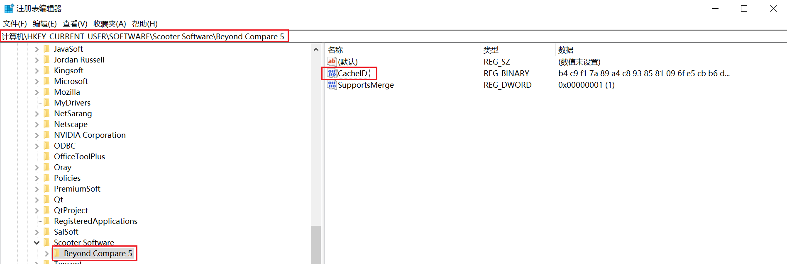
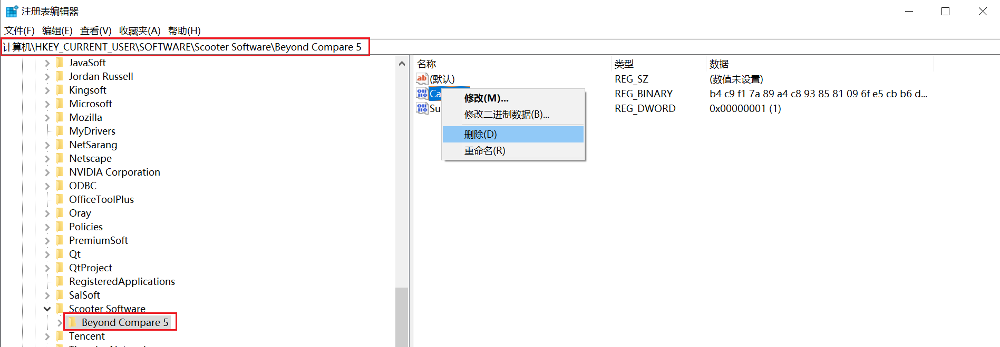

# Beyond Compare 重置试用期

本文将介绍如何重置 Beyond Compare 的试用期，适用于需要临时延长试用时间的场景。

## 1. 打开注册表编辑器

- 按下`Win+R`组合键打开运行对话框
- 输入`regedit`并回车

::: tip 提示
如果系统弹出用户账户控制提示，请点击「是」允许注册表编辑器运行
:::



## 2. 定位 Beyond Compare 注册表项

在注册表编辑器的地址栏中粘贴以下路径并回车

```bash
计算机\HKEY_CURRENT_USER\SOFTWARE\Scooter Software\Beyond Compare 5
```



## 3. 重置试用期

- 在右侧窗口中找到名为 `CacheID` 的项
- 右键点击该项目
- 选择「删除」确认删除操作

::: warning 
注意删除前请确保已关闭 Beyond Compare 程序，否则可能导致设置不生效 
:::




## 4. 完成重置

操作完成后，重新启动 Beyond Compare 即可享受延长的试用期。

::: warning 
注意此方法仅用于临时测试软件功能，长期使用请支持正版软件 
:::