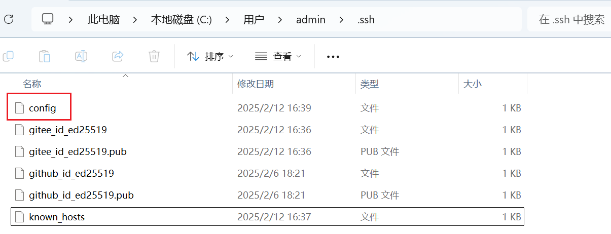
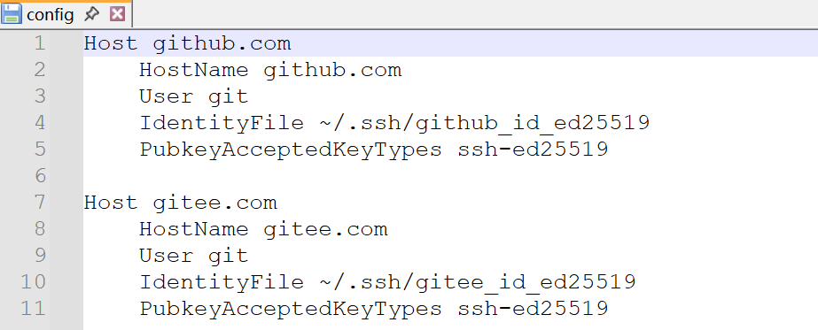

# Git 实用教程

本文整理了 Git 日常使用中的核心操作，包括基础配置、SSH 密钥管理、工具配置及冲突解决等实用技巧，适合新手快速上手。

## 1. Git 基础配置

### 1.1 设置用户信息

首次使用 Git 需配置全局用户信息（--global 表示全局生效）

```bash
# 设置全局用户名
git config --global user.name "wangyongwang"
# 设置全局邮箱
git config --global user.email "13327418643@163.com"
```

::: tip 
提示若需为单个项目配置不同的用户信息，可在项目目录下执行命令时去掉 --global 参数
:::

### 1.2 查看当前用户信息

查看已配置的用户名和邮箱

```bash
git config user.name
git config user.email
```

## 2. Git SSH 密钥配置

SSH 密钥可实现与代码托管平台的免密通信，推荐使用更安全的加密算法。

### 2.1 生成 SSH 密钥

```bash
# RSA 算法（兼容性好，适合旧系统）
ssh-keygen -t rsa -f ~/.ssh/gitee_id_rsa -C "13327418643@163.com"
ssh-keygen -t rsa -f ~/.ssh/github_id_rsa -C "13327418643@163.com"
# ED25519 算法（推荐，安全性更高）
ssh-keygen -t ed25519 -f ~/.ssh/gitee_id_ed25519 -C "13327418643@163.com"
ssh-keygen -t ed25519 -f ~/.ssh/github_id_ed25519 -C "13327418643@163.com"
ssh-keygen -t ed25519 -f ~/.ssh/gitlab_id_ed25519 -C "13327418643@163.com"
```

#### 为什么推荐 ED25519

与传统 RSA 相比，ED25519 具有明显优势：

- 更高安全性：256 位密钥强度，椭圆曲线密码学提供更强防护
- 生成速度快：密钥创建效率远超 RSA
- 存储占用小：密钥长度更短，节省存储空间

### 2.2 多平台密钥配置

通过 `~/.ssh/config` 文件管理不同平台的密钥映射，实现一把钥匙开一把锁：





::: code-group

```ini [GitHub]
Host github.com
	HostName github.com # 实际连接的域名
	User git			# 固定用户名
	IdentityFile ~/.ssh/github_id_ed25519 	# 对应密钥路径
	PubkeyAcceptedKeyTypes ssh-ed25519		# 允许的密钥类型
```

```ini [Gitee]
Host gitee.com
	HostName gitee.com
	User git
	IdentityFile ~/.ssh/gitee_id_ed25519
	PubkeyAcceptedKeyTypes ssh-ed25519
```

```ini [GitLab]
Host 188.18.45.211
	HostName 188.18.45.211	 # 服务器IP地址
	User git
	IdentityFile ~/.ssh/gitlab_id_ed25519
	PubkeyAcceptedKeyTypes ssh-ed25519
```

```ini [虚拟机]
Host 192.168.244.132
	HostName 192.168.244.132
	User wyw	# 虚拟机登录用户名
```

:::

:::

::: tip 

验证配置配置完成后，可通过以下命令测试连接：

```bash
ssh -T git@github.com  # 测试GitHub连接
```

```bash
ssh -T git@gitee.com   # 测试Gitee连接
```

出现欢迎信息即表示配置成功

:::

## 3. TortoiseGit 配置

### 问题：SSH 密钥未正确关联

TortoiseGit 可能因 SSH 客户端路径错误，导致默认使用了其他方式（如密码认证），而非 SSH 密钥认证。

**解决步骤**：

- 右键任意文件夹 → 选择 `TortoiseGit` → `Settings` 打开设置面板
- 在左侧导航栏找到 `Network` → `SSH client`
- 点击「浏览」选择 Git 自带的 `ssh.exe`（通常路径为：`C:\Program Files\Git\usr\bin\ssh.exe`）
- 点击 `Apply` 保存设置，重新操作即可生效

## 4. Git 冲突解决流程

当多人协作修改同一文件时，可能出现代码冲突，推荐解决流程：

```bash
# 1. 暂存本地修改（避免冲突覆盖）
git stash

# 2. 查看暂存列表（确认暂存成功）
git stash list

# 3. 拉取远程最新代码
git pull

# 4. 恢复本地暂存的修改（自动尝试合并）
git stash pop
```

::: warning 

注意若执行 `git stash pop` 后出现冲突，需打开冲突文件，找到 `<<<<<<< HEAD` 标记的冲突区域，手动编辑保留正确代码后再提交

:::

## 5. Git 代码提交

```bash
# 添加所有修改到暂存区（. 表示当前目录所有文件）
git add .

# 提交到本地仓库（-m 后为提交说明，建议清晰描述修改内容）
git commit -m "feat: 新增用户登录功能"
```

::: tip 

提交规范建议遵循约定式提交（Conventional Commits）规范，例如：

- `feat:` 表示新功能

- `fix:` 表示修复 bug

- `docs:` 表示文档更新

- `style:` 表示代码格式调整（不影响逻辑）

:::
