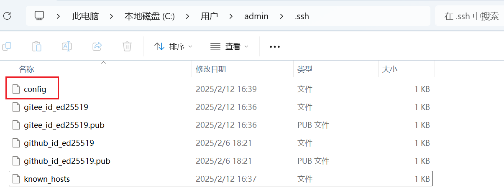
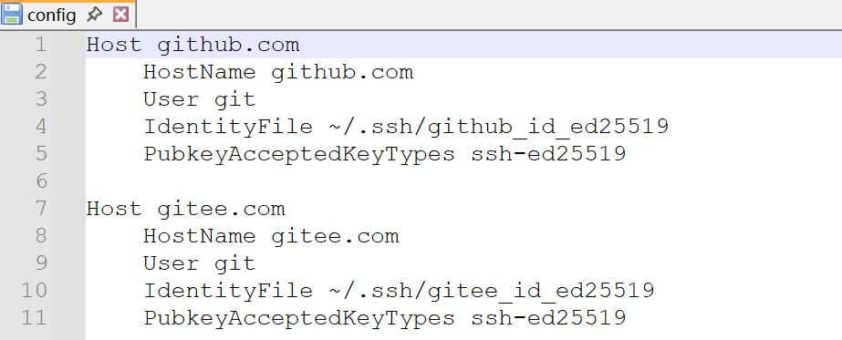

# Git教程

## 1. Git基本信息

- 查看git用户名和邮箱

  ```bash
  git config user.name
  git config user.email
  ```

- 设置git用户名和邮箱

  ```bash
  git config user.name "unclewang12138"
  git config user.email "unclewang12138@gmail.com"
  ```

## 2. Git的SSH配置

### 2.1 创建密钥

```bash
ssh-keygen -t rsa -f ~/.ssh/gitee_id_rsa -C "13327418643@163.com"
ssh-keygen -t rsa -f ~/.ssh/github_id_rsa -C "unclewang12138@gmail.com"
ssh-keygen -t ed25519 -f ~/.ssh/gitee_id_ed25519 -C "13327418643@163.com"
ssh-keygen -t ed25519 -f ~/.ssh/github_id_ed25519 -C "unclewang12138@gmail.com"
ssh-keygen -t ed25519 -f ~/.ssh/gitlab_id_ed25519 -C "13327418643@163.com"
```

推荐**ED25519** 加密算法
**ED25519**相比**RSA**有以下几点优势：

- 更高的安全性：**ED25519**比**RSA**更安全，因为它使用更长的密钥（256位）和更好的密码学属性。**RSA**加密算法的安全性基于大质数的难以分解性质。**ED25519**使用的是椭圆曲线密码学，具有更好的安全性。
- 更快的密钥生成速度：**ED25519**密钥的生成速度比**RSA**更快，这意味着你可以更快地创建和使用SSH密钥。
- 更少的存储空间：**ED25519**密钥比**RSA**更短，占用更少的存储空间。

### 2.2 配置托管平台

通过**config**配置文件，来使用不同的密钥连接不同的代码托管平台





::: code-group

```yaml [GitHub]
Host github.com
	HostName github.com
	User git
	IdentityFile ~/.ssh/github_id_ed25519
	PubkeyAcceptedKeyTypes ssh-ed25519
```

```yaml [Gitee]
Host gitee.com
	HostName gitee.com
	User git
	IdentityFile ~/.ssh/gitee_id_ed25519
	PubkeyAcceptedKeyTypes ssh-ed25519
```

```yaml [GitLab]
Host 188.18.45.211
	HostName 188.18.45.211
	User git
	IdentityFile ~/.ssh/gitlab_id_ed25519
	PubkeyAcceptedKeyTypes ssh-ed25519
```

```yaml [虚拟机]
Host 192.168.244.132
	HostName 192.168.244.132
	User wyw
```

:::

## 3. TortoiseGit配置

### 未正确关联 SSH 密钥

TortoiseGit 可能没有找到你的 SSH 密钥路径，导致默认使用了其他方式（如密码认证），而非 SSH 密钥认证。

**解决方法**：

- 打开 TortoiseGit 的设置：右键任意文件夹 → `TortoiseGit` → `Settings`。
- 在左侧导航栏找到 `Network` → `SSH client`，确保路径指向 Git 自带的 `ssh.exe`（通常在 `C:\Program Files\Git\usr\bin\ssh.exe`），而非系统自带的 SSH 客户端。
- 点击 `Apply` 保存设置，重新尝试拉取，此时应该会正确使用你的 SSH 密钥。

## 4. Git解决冲突

```bash
git pull
# 暂存修改
git stash
git stash list
git pull
# 还原暂存的内容
git stash pop 
```
