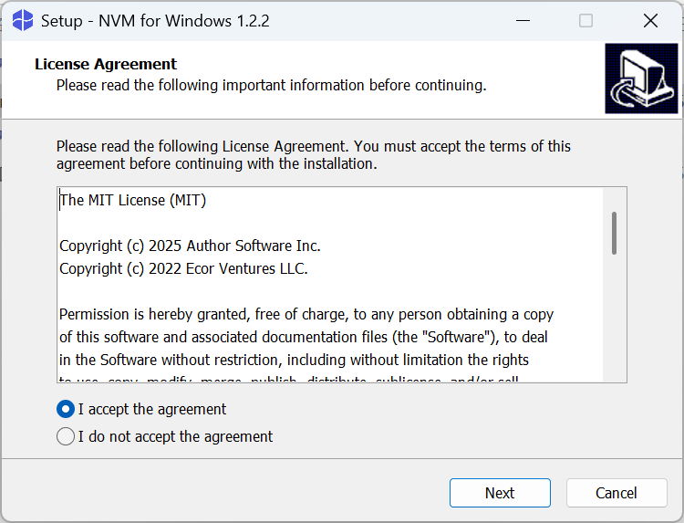
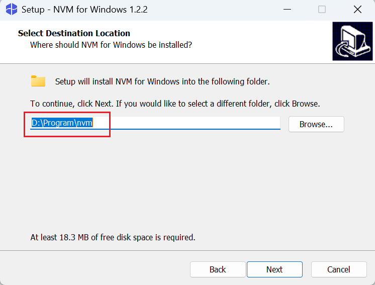
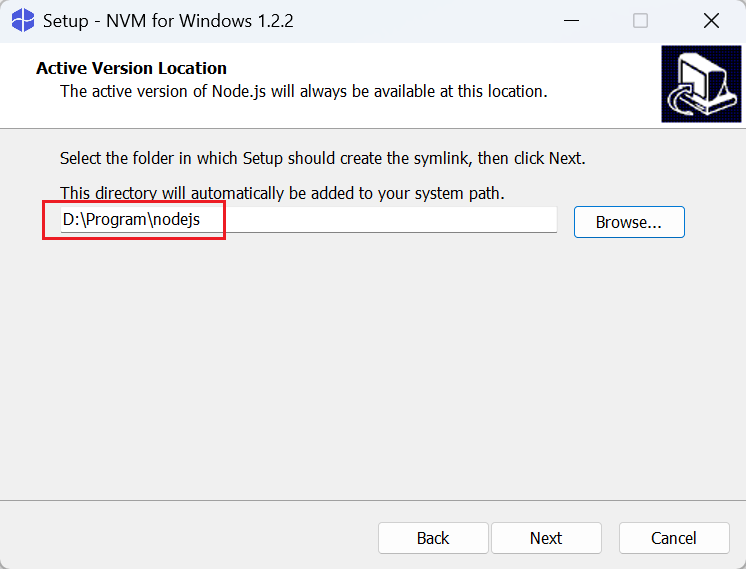
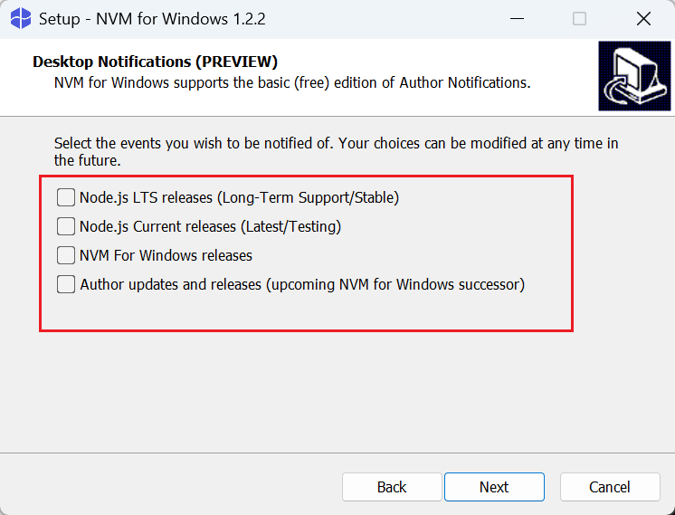
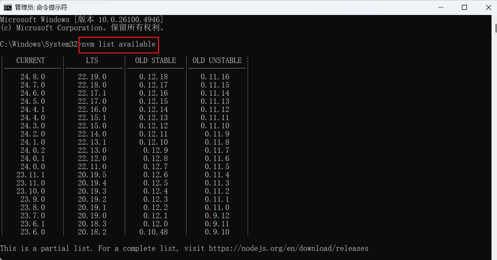
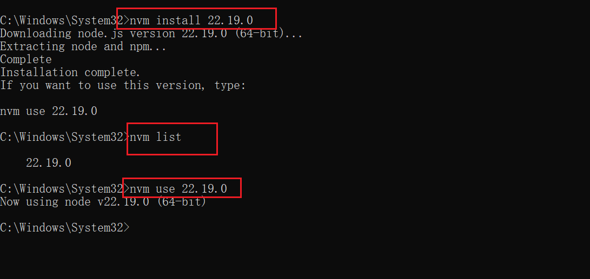
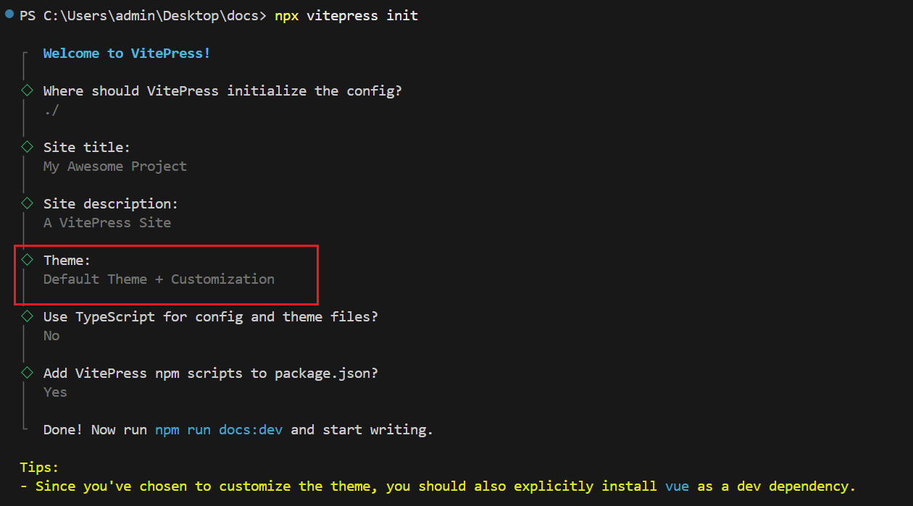
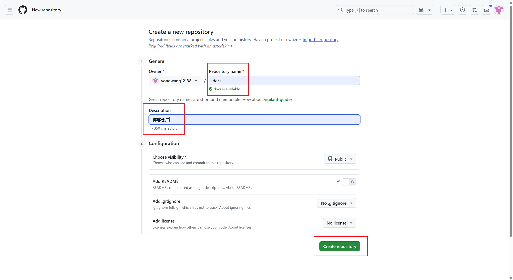
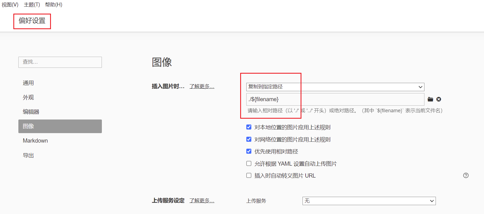

# VitePress博客搭建

## 1. 📥安装Node版本管理工具

### 1.1 下载nvm-windows并安装

官网地址: [GitHub - coreybutler/nvm-windows: A node.js version management utility for Windows. Ironically written in Go.](https://github.com/coreybutler/nvm-windows)








::: tip
这里取消新版提示
:::



### 1.2 安装Node.js

**使用管理员身份运行cmd**

```bash
# 查看可安装的node版本
nvm list available
```



```bash
# 安装指定版本node 
nvm install 22.19.0
# 查看已安装版本的node 
nvm list 
# 切换使用指定的版本的node
nvm use 22.19.0
```



## 2. 创建项目

```bash
# 安装vitepress
npm add -D vitepress
# 初始化Vitepress
npx vitepress init
```



## 3. 自定义配置

### 3.1 index.md配置

```yaml
---
# https://vitepress.dev/reference/default-theme-home-page
layout: home

hero:
  name: "Mars星球"
  text: "一个 VitePress 博客"
  tagline: 将有一天你会拥有美好的一切
  image:
    src: /background.svg
    alt: 背景图
  actions:
    - theme: brand
      text: Markdown 示例
      link: /markdown-examples
    - theme: alt
      text: API 示例
      link: /api-examples

features:
  - title: 特性 A
    details: 特性 A 的详细描述
  - title: 特性 B
    details: 特性 B 的详细描述
  - title: 特性 C
    details: 特性 C 的详细描述
---
```

### 3.2 config.mjs配置

```js
import { defineConfig } from 'vitepress'

// https://vitepress.dev/reference/site-config
export default defineConfig({
  base: "/docs/",
  head: [["link", { rel: "icon", href: "/docs/logo.svg" }]],
  title: "Mars星球",
  description: "A VitePress Site",
  themeConfig: {
    logo: '/logo.svg',
    // https://vitepress.dev/reference/default-theme-config
    nav: [
      { text: '主页', link: '/' },
      { text: '示例', link: '/markdown-examples' },
      { text: '教程', items: [
        { text: 'vitepress博客搭建', link: '/tutorial/vitepress' },
      ] }
    ],

    // 右侧导航栏
    outlineTitle: '文章目录',
    outline: [2, 6], // 目录显示2-6级标题

    sidebar: false, // 关闭侧边栏
    aside: "left", // 设置右侧侧边栏在左侧显示

    socialLinks: [
      { icon: 'github', link: 'https://github.com/yongwang12138' }
    ],
    // 底部配置
    footer: {
      copyright: 'Copyright © 2025 Mars星球'
    },
    // 设置搜索框的样式
    search: {
      provider: "local",
      options: {
        translations: {
          button: {
            buttonText: "搜索文档",
            buttonAriaLabel: "搜索文档",
          },
          modal: {
            noResultsText: "无法找到相关结果",
            resetButtonTitle: "清除查询条件",
            footer: {
              selectText: "选择",
              navigateText: "切换",
            },
          },
        },
      },
    },
  }
})
```
## 4. 启动和构建项目

1. **`npm run docs:dev`**
   - 启动开发服务器，用于文档的本地开发
   - 会实时监听文件变化并自动刷新浏览器，方便实时预览编辑效果
   - 通常运行在本地端口（如 `http://localhost:5173`），仅用于开发环境
2. **`npm run docs:build`**
   - 对文档进行生产环境构建，生成可部署的静态文件
   - 构建产物通常输出到 `docs/.vitepress/dist` 目录
   - 构建后的文件经过优化（压缩、Tree-shaking 等），适合部署到服务器
3. **`npm run docs:preview`**
   - 构建完成后，启动一个本地服务器预览生产环境的构建结果
   - 用于检查 `docs:build` 生成的静态文件是否正常工作
   - 模拟真实部署后的效果，帮助发现生产环境特有的问题

## 5. 使用Github Pages部署

### 5.1 创建博客仓库



### 5.2 提交仓库

```bash
# 将本地 master 分支重命名为 main
git branch -M main
# 关联远程仓库
git remote add origin git@github.com:yongwang12138/blog.git
# 推送本地 main 分支到远程
git push -u origin main
```

### 5.3 设置工作流


```yaml
# 构建 VitePress 站点并将其部署到 GitHub Pages 的示例工作流程
#
name: Deploy VitePress site to Pages

on:
  # 在针对 `main` 分支的推送上运行。如果你
  push:
    branches: [main]

  # 允许你从 Actions 选项卡手动运行此工作流程
  workflow_dispatch:

# 设置 GITHUB_TOKEN 的权限，以允许部署到 GitHub Pages
permissions:
  contents: read
  pages: write
  id-token: write

# 只允许同时进行一次部署，跳过正在运行和最新队列之间的运行队列
# 但是，不要取消正在进行的运行，因为我们希望允许这些生产部署完成
concurrency:
  group: pages
  cancel-in-progress: false

jobs:
  # 构建工作
  build:
    runs-on: ubuntu-latest
    steps:
      - name: Checkout
        uses: actions/checkout@v4
        with:
          fetch-depth: 0 # 如果未启用 lastUpdated，则不需要
      # - uses: pnpm/action-setup@v3 # 如果使用 pnpm，请取消注释
      # - uses: oven-sh/setup-bun@v1 # 如果使用 Bun，请取消注释
      - name: Setup Node
        uses: actions/setup-node@v4
        with:
          node-version: 22
          cache: npm # 或 pnpm / yarn
      - name: Setup Pages
        uses: actions/configure-pages@v4
      - name: Install dependencies
        run: npm ci # 或 pnpm install / yarn install / bun install
      - name: Build with VitePress
        run: npm run docs:build # 或 pnpm docs:build / yarn docs:build / bun run docs:build
      - name: Upload artifact
        uses: actions/upload-pages-artifact@v3
        with:
          path: .vitepress/dist

  # 部署工作
  deploy:
    environment:
      name: github-pages
      url: ${{ steps.deployment.outputs.page_url }}
    needs: build
    runs-on: ubuntu-latest
    name: Deploy
    steps:
      - name: Deploy to GitHub Pages
        id: deployment
        uses: actions/deploy-pages@v4
```


## 6. 设置Typora的图片路径

::: tip
**注意**：将Typora的图片保存路径设置为相对路径，这样可以确保图片在博客中正确显示
:::


